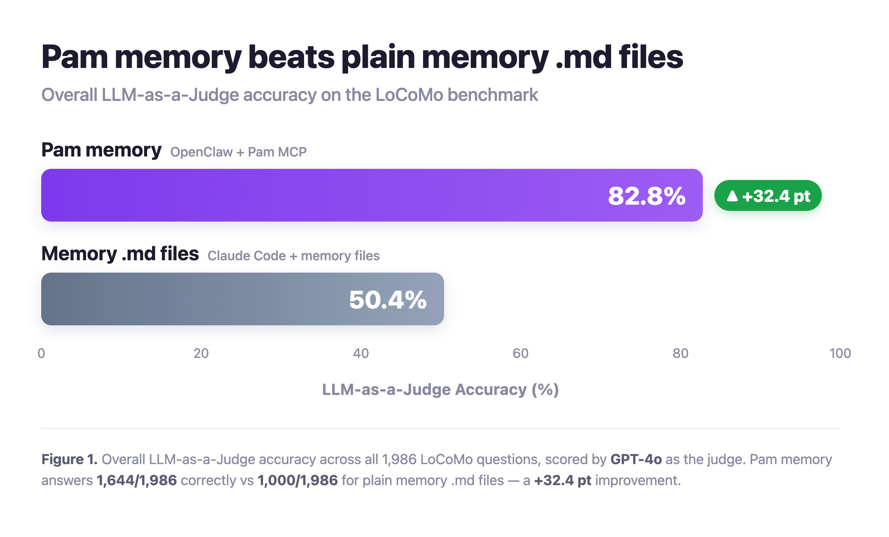

<div align="center">

<a href="https://manager.harmix.ai">
  
</a>

# Pam Benchmark

**An open industrial benchmark for AI memory — how well do memory systems recall long-horizon conversational and organizational context?**

[](LICENSE)
[](.python-version)
[](https://github.com/astral-sh/uv)

[Harmix](https://www.harmix.ai) · [Pam (product)](https://manager.harmix.ai) · [Blog](https://manager.harmix.ai/blog) · [Research](https://manager.harmix.ai/research)

</div>

---

This is the benchmark [Harmix](https://www.harmix.ai) uses to validate **Pam**'s memory layer against other AI-memory systems. Pam (*Proactive AI Manager*) is an enterprise AI assistant that learns continuously from organizational data — documents, ERP/CRM, Linear, Slack — to anticipate problems and automate work. The whole product hinges on accurate long-horizon recall, so this harness answers one question repeatedly, with reproducible numbers: **is Pam's memory at least as good as the best dedicated memory systems on the tasks our customers care about?**

We're publishing it for transparency behind the results we cite in our blog posts.

## 📊 Headline Result

<div align="center">
  
</div>

On the full **LoCoMo** benchmark (1,986 questions, LLM-as-a-Judge scored by GPT-4o), Pam's memory answers **1,644/1,986 (82.8%)** correctly versus **1,000/1,986 (50.4%)** for plain Memory.md files on a coding-agent harness — a **+32.4 pt** improvement. See [`docs/blog_post_notes_locomo.md`](docs/blog_post_notes_locomo.md) for our broader LoCoMo results write-up.

## 🧠 What This Repo Is

A single, uniform harness that runs different systems-under-test over the same datasets, with the same scoring, so the numbers are directly comparable. Each run:

1. Loads a dataset of long multi-session conversations with QA pairs.
2. Feeds each conversation to a **baseline** (a plain LLM, Pam's memory API, or a memory system running on an agentic harness).
3. Asks the baseline every question and scores answers with **token-F1** and an **LLM-as-a-Judge** rubric.
4. Records per-question tokens, latency, and cost, and renders an HTML/Markdown report.

Why a custom benchmark? Public memory benchmarks are saturating for top models, don't cover Harmix-shaped workloads (multi-tool coordination, long retrospectives), and don't run competitors uniformly on the same data with the same scoring. This harness does.

## 📚 Datasets

| Dataset | Status | Samples | Task | Source |
|---|---|---|---|---|
| **LoCoMo** | ✅ Shipped | 10 conversations · ~1,986 QA total | Multi-session dialogue QA across single-hop, temporal, open-domain, multi-hop, and adversarial recall | [snap-research/locomo](https://github.com/snap-research/locomo) ([ACL 2024](https://aclanthology.org/2024.acl-long.747.pdf)) |
| **MEMTRACK** | 🚧 Planned | — | Multi-tool coordination (Linear + Slack event histories) with cross-system references — closest to Pam's production workload | Harmix internal (synthetic) |
| **LongMemEval** | 🚧 Planned | — | Long-conversation memory eval | [LongMemEval](https://github.com/xiaowu0162/LongMemEval) |

Dataset details and licensing live in each dataset's README, e.g. [`src/datasets/locomo/README.md`](src/datasets/locomo/README.md).

## 🏆 Baselines

A *baseline* is one system-under-test, implemented against the `Baseline` protocol in [`src/baselines/base.py`](src/baselines/base.py).

| Baseline | What it is | Memory | Status |
|---|---|---|---|
| **LiteLLM models** (`gpt-4-turbo`, `gpt-4o`, …) | Any LiteLLM-supported model; the full conversation is packed into each prompt (no external memory) | None | ✅ Shipped |
| **Pam** (`pam`) | Harmix's in-house memory layer via the Pam HTTP API — uploads the conversation, builds a memory, answers in batches | External (Pam) | ✅ Shipped |
| **Claude Code + Memory.md** (`memory_md_mcp`) | A filesystem-Markdown memory backend running on the Claude Code agentic harness | External (Markdown files) | ✅ Shipped |
| Dedicated memory products (mem0, Zep, Supermemory, Honcho) | Other memory APIs run through the same harness | External | 🚧 Planned |

See [`src/baselines/README.md`](src/baselines/README.md), [`src/baselines/pam/README.md`](src/baselines/pam/README.md), and [`docs/mcp_harness_benchmark_plan.md`](docs/mcp_harness_benchmark_plan.md).

## 🛠️ Dependencies

- **Python 3.12** and **[uv](https://github.com/astral-sh/uv) ≥ 0.5** (the only thing you install by hand; `uv sync` does the rest).
- Core libraries: `litellm` + `instructor` (model calls), `pydantic` + `typer` + `rich` (CLI), `pymongo` (result store), `tiktoken` / `nltk` / `scipy` (scoring & stats), `jinja2` (reports), `asyncpg` (Pam metrics). Full pin set in [`pyproject.toml`](pyproject.toml) / [`uv.lock`](uv.lock).
- **Optional services:** MongoDB (result store — skip with `--no-mongo`); a Claude Code CLI + Vertex AI access for the agentic-harness experiment; Pam API credentials for the `pam` baseline.

Secrets are read from a gitignored `secrets.env` (see [How to Use](#-how-to-use)).

## 📁 Repository Structure

```
.
├── src/                         # PYTHONPATH=src
│   ├── cli.py / mcp_cli.py      # CLI definitions for the two run modes
│   ├── runner.py registry.py    # run loop + name→object lookups
│   ├── config.py seeds.py mongo.py
│   ├── datasets/<name>/         # one loader per dataset (locomo shipped)
│   ├── baselines/<name>/        # one system-under-test per baseline
│   ├── harnesses/<name>/        # agentic harnesses (claude_code)
│   ├── tasks/<name>/            # per-dataset pipeline + prompts
│   ├── evals/                   # metrics: qa_f1, llm_judge, efficiency, runtime, stats
│   └── reporting/               # Mongo → HTML/MD renderer
├── scripts/                     # entrypoints (run_benchmark, run_mcp_benchmark, generate_report, download_data)
├── cluster/                     # Dockerfiles + image build/push scripts (Cloud Run Jobs)
├── tests/                       # ~200 unit tests; no live LLM calls
├── docs/                        # design docs, plans, blog notes
├── pyproject.toml uv.lock       # uv-managed dependencies
└── LICENSE                      # Apache-2.0
```

## 🚀 How to Use

**Prerequisites:** `uv ≥ 0.5`, Python 3.12, a `secrets.env`, and the LoCoMo data at `src/datasets/locomo/data/locomo10.json`.

```bash
# 1. Install dependencies
uv sync

# 2. (optional) install git pre-commit hooks
uv run pre-commit install

# 3. Verify the dataset is in place
uv run python scripts/download_data.py --dataset locomo

# 4. Smoke run — 1 sample, 5 questions, gpt-4-turbo
uv run python scripts/run_benchmark.py \
  --dataset locomo --baseline gpt-4-turbo \
  --exp-name local_smoke --sample-index 0 --max-questions 5

# 5. Render the HTML report
uv run python scripts/generate_report.py --exp-name local_smoke
open reports/local_smoke/report.html
```

`--exp-name` is the key that groups results, artifacts, and reports. For multi-seed runs, call `run_benchmark.py` N times with the same `--exp-name` and different `--seed`. Everything works without Mongo via `--no-mongo`.

**Run Pam** (needs `PAM_API_*` secrets): swap in `--baseline pam` and tune `--pam-batch-size`.

**Run a memory system on an agentic harness** (needs a `claude` CLI + Vertex secrets):

```bash
uv run python scripts/run_mcp_benchmark.py \
  --dataset locomo --harness claude-code --baseline memory_md_mcp \
  --harness-model <vertex-claude-model-id> --exp-name mcp_locomo_md_v1 \
  --mcp-batch-size 10
```

### `secrets.env`

A gitignored file with the keys for whatever you run. Minimal set for an LLM baseline:

```bash
OPENAI_API_KEY=sk-...
CONNECTION_STRING=mongodb+srv://...   # omit and pass --no-mongo to skip Mongo
DB_NAME=your-db
```

The `pam` baseline additionally needs `PAM_API_*` (and `DATABASE_*` for agent-side token metrics); the agentic-harness experiment needs `VERTEX_PROJECT_ID` / `VERTEX_REGION` / `VERTEX_CREDENTIALS`. The full per-baseline list is in [`src/baselines/pam/README.md`](src/baselines/pam/README.md) and [`docs/mcp_harness_benchmark_plan.md`](docs/mcp_harness_benchmark_plan.md).

### Outputs

- **Local:** `outputs/<exp-name>/<seed>/` with `config.yaml` (resolved run config) and `metrics.json` (aggregate metrics).
- **Mongo:** one document per `(exp_name, sample_id, seed)` in `<dataset>_results`, with the full per-question payload (question, expected, answer, F1, judge verdict, tokens, latency).
- **Reports:** `reports/<exp-name>/report.html`, rendered on demand from Mongo.

### Running on the cloud

Dockerfiles and image build/push scripts live in [`cluster/`](cluster/) — one set for the standard runner (`cluster/run_benchmark/`) and one for the agentic-harness experiment (`cluster/run_mcp_benchmark/`, which bundles the Claude Code CLI). Build & push with the relevant `build_and_push.sh`, then run the image as a Cloud Run Job. Point the scripts at your own GCP project, Artifact Registry repo, and Secret Manager entries.

## 🧪 Tests & Quality

```bash
env PYTHONPATH=src uv run pytest -q     # ~200 unit tests (no live LLM calls)
uv run ruff check src scripts tests     # lint
uv run ruff format src scripts tests    # format
uv run pre-commit run --all-files       # everything CI runs
```

CI ([`.github/workflows/ci.yml`](.github/workflows/ci.yml)) runs lint, format, and tests on every PR to `main`.

## ➕ Adding a Dataset or Baseline

- **Dataset:** add `src/datasets/<name>/{loader.py,schemas.py}` implementing `DatasetLoader`, then register it in `src/registry.py`.
- **Baseline:** subclass `Baseline` from `src/baselines/base.py` (reuse `LiteLLMBaseline` for plain LLMs), then register it in `src/registry.py`.

Patterns and conventions: [`src/baselines/README.md`](src/baselines/README.md).

## 📖 Documentation

| Doc | What's in it |
|---|---|
| [`docs/blog_post_notes_locomo.md`](docs/blog_post_notes_locomo.md) | LoCoMo results write-up and blog notes (Pam vs. other memory systems) |
| [`docs/mcp_harness_benchmark_plan.md`](docs/mcp_harness_benchmark_plan.md) | Design of the memory-on-agentic-harness experiment |
| [`docs/benchmark_rewrite_plan.md`](docs/benchmark_rewrite_plan.md) | Architecture, decisions, and roadmap of the harness |
| [`docs/init_memory_bank.md`](docs/init_memory_bank.md) | Methodology standards (datasheets, model cards, reproducibility) |
| [`src/baselines/pam/README.md`](src/baselines/pam/README.md) | How the Pam baseline talks to the Pam API |

## 📄 License

Code in this repository is licensed under the **[Apache License 2.0](LICENSE)**.

Datasets keep their own upstream licenses and are **not** redistributed here — the LoCoMo data file is gitignored and bound by its [upstream terms](https://github.com/snap-research/locomo). Review a dataset's license before redistributing it.

## 🔗 Links

- **Harmix** — <https://www.harmix.ai>
- **Pam product** — <https://manager.harmix.ai>
- **Blog** — <https://manager.harmix.ai/blog>
- **Research** — <https://manager.harmix.ai/research>

<div align="center"><sub>Built by <a href="https://manager.harmix.ai">Harmix</a> — proactive AI memory for the enterprise.</sub></div>
